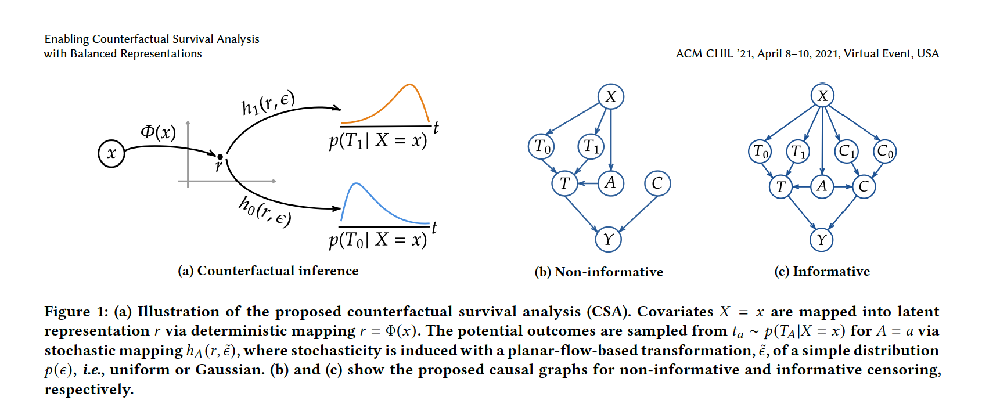

# Enabling Counterfactual Survival Analysis with Balanced Representations (ACM CHIL 2021)

This repository contains the Pytorch code to replicate experiments in our paper [Enabling Counterfactual Survival Analysis with Balanced Representations](https://arxiv.org/abs/2006.07756) accepted at ACM Conference on Health, Inference, and Learning (ACM CHIL) 2021:

```latex
@inproceedings{chapfuwa2021enabling, 
  title={Enabling Counterfactual Survival Analysis with Balanced Representations},
  author={Chapfuwa, Paidamoyo and Assaad, Serge and Zeng, Shuxi and Pencina, Michael J and Carin, Lawrence and Henao, Ricardo},
  booktitle={ACM Conference on Health, Inference, and Learning},
  year={2021}
}
```

#  Counterfactual Survival Analysis
This repository contains Pytorch code for Counterfactual Survival Analysis

## Model


## Data
- [ACTG](https://rdrr.io/cran/BART/man/ACTG175.html) is longitudinal RCT study comparing monotherapy with Zidovudine or Didanosine with combination therapy in HIV patients
- [Framingham](https://framinghamheartstudy.org/): A subset (Framingham Offspring) of the longitudinal study of heart
disease dataset, for predicting the effects of statins on survival time
- See [actg_synthetic.ipynb](./actg_synthetic.ipynb) to modify the generated actg-synthetic data

## Prerequisites
The code is implemented with the following dependencies:

- [Python  3.6.4](https://github.com/pyenv/pyenv)
- [Torch 0.4.1](https://pytorch.org/)
- Additional python packages can be installed by running:   

```
pip install -r requirements.txt
```

## Model Training

* To train all models (CSA, CSA-INFO, AFT, AFT-Weibull, SR) run [param_search.py](./param_search.py) 

```
 python param_search.py
```

* The hyper-parameters settings can be found at [**.config/configs.txt**](./config/configs.txt)

## Metrics and Visualizations

Once the networks are trained and the results are saved, we extract the following key results: 

* Training and evaluation metrics are logged in **model_*.log**
* Epoch based cost function plots can be found in the [**plots**](./plots) directory
* Numpy files to generate calibration and cluster plots are saved in  [**matrix**](./matrix) directory
* To select best validation **alpha** compute likelihoods according to [evaluation_alpha_selection.ipynb](./evaluation_alpha_selection.ipynb) 
* Run the [evaluation_ITE.ipynb](./evaluation_ITE.ipynb) to generate factual and causal metrics 
and [evaluation_stratify_HR.ipynb](./evaluation_stratify_HR.ipynb) for HR risk stratification 


## Acknowledgments
This work leverages the calibration framework from [SFM](https://ieeexplore.ieee.org/document/9244076) and the accuracy objective from [DATE](https://arxiv.org/pdf/1804.03184.pdf). Contact [Paidamoyo](https://github.com/paidamoyo) for issues relevant to this project.
